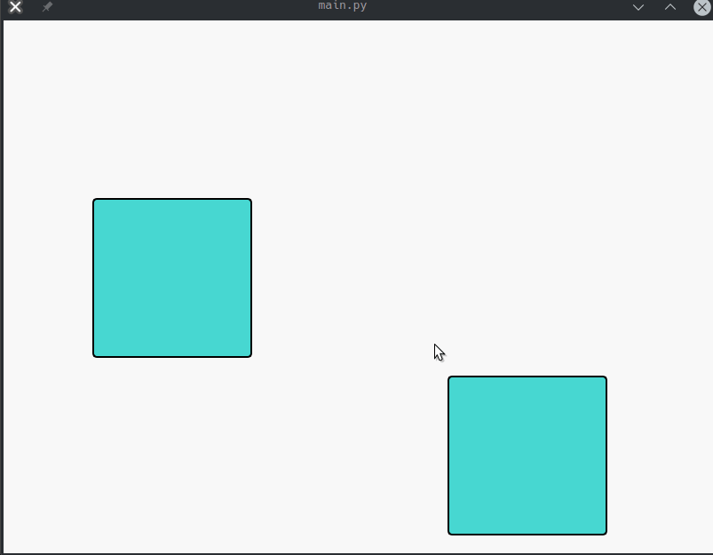

# Draggable and Stickable Widgets in PyQt5

## Overview

Simple Project to demonstrates how to create draggable and stickable widgets using PyQt5. The application allows users to move widgets around the window and "stick" them to one another when they are close enough.

## Features

- **Draggable Widgets**: DoubleClick and drag to move widgets within the application window.
- **Stickable Functionality**: Widgets snap to each other when they are within a specified proximity.

## Requirements

- Python 3.x
- PyQt5

## Installation

1. Clone the repository:

   ```bash
   git clone https://github.com/yourusername/draggable-stickable-widgets.git

## Demo


